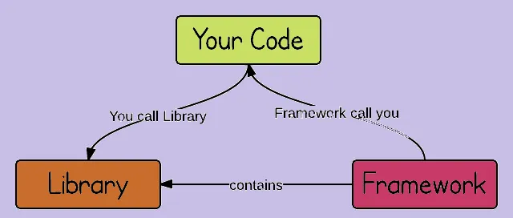
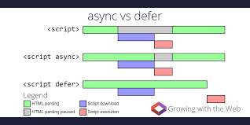

# Inception

What is Emmet ?
 
Emmet is a plugin or developer tool kit helps make your work faster and substantially enhances HTML and CSS workflows.

Difference between a Library and Framework ?

Libraries consist of a set of components that serve a particular purpose. whereas a framework consists of many tools and libraries that make the dvelopment process easy.

---------------------------------------------------------------------------------
# What is CDN ? Why do we use it ?

CDN stands for - Content Delivery Network.

It is a network of interconnected servers that provides high availability and performance for the data heavy or the complex applications.

CDN is a geographically distributed network of proxy servers and its goal is to serve the relative end users with high performance and availablility.

We use CDN in our application, if we do  not install it and if we want to make use of it, then we can place the cdn links 

CDN link for React:

CDN link for ReactDOM:

---------------------------------------------------------------------------------

# Why is React known as React ?

React is a JavaScript library that is used to develop the user interfaces and is developed by Facebook.

The name "React" aptly suits it, because, In react, we make use of the virtual DOM, which would store the state of all the components. Whenever there is a change or modification occurs in the application, reactively the changes can be observed in the web application as well. hence it is called as React.

---------------------------------------------------------------------------------
# What is cross-origin in the script tag ?

cross-origin is the attribute that sets the mode of the request to http CORS Request.

CORS -> Cross Origin Resource Sharing. It is a mechanism that is used for integrating the multiple web applications. CORS defines a way for the client web applications that the code developed in one domain to be shared with the resources in the another domain.

---------------------------------------------------------------------------------

# What is the difference between React and ReactDOM ?

React focuses on the component creation and state management, while ReactDOM handles rendering and DOM interactions.

---------------------------------------------------------------------------------

# What is the difference between react.development.js and react.production.js file via CDN ?

When we run the application in the production mode, the code is minified, compressed, tree shaked and finally bundled with either webpack / Parcel in the scenes behind and we get a minified files for the production ready environment.
    1.  Minified.
    2.  Compressed.
    3.  Tree Shaked.
    4.  Console Clear.
    5.  bundled.
    6.  Production Ready Files.

whereas in the developement mode, if we run the application, we does not get a minified code, moreover we have many features like
    1.  Debugging.
    2.  HMR ( Hot Module Replacement)
    3.  Several other dependencies which are not a part of devDependencies.

Also the performance will be much faster in production when compared to the development mode.

---------------------------------------------------------------------------------

# What are async and defer ?

async and defer are the boolean attributes that are used in our script tags that helps us to load the external scripts efficiently into our web page.

Async: 
------

While the HTML parsing was running and if the script tag has the boolean async then, fetching the  scripts from the network asynchronously, once they are loaded, HTML parsing will be paused and execute the scripts then and there and once script executions were done , then the HTML parsing continues.

But using async with multiple dependencies does not bother about the order of execution so we need to think wise choosing the attriute.

It is always best to use async if the multiple dependencies are independent.

Defer:
------
While the HTML parsing was running and if the script tag has the boolean defer then, fetching the scripts from the network are done paralleling without HTML parsing pause and even once the scripts are ready and loaded they does not start execution. Once the HTML parsing was done then the loaded scripts starts execution.

Hence defer is the best boolean attribute to use if there are multiple dependencies and they are dependent.
because defer attribute minds the order of execution of scripts unlike async.

