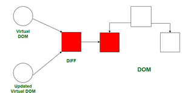
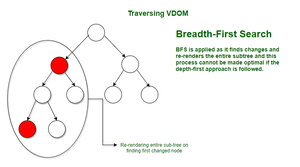

# Talk is cheap, show the code!

1.  **Is JSX mandatory for React?**

    No, JSX is not mandatory for React. You can even develop React components using the plain HTML.
    Yet, JSX has come into the play just to provide easiness for the developers.

    You can use the code for createElement as below:

    **React.createElement("h1", {}, "Hi I am React Element!");**

2.  **Is ES6 mandatory for React?**

    Preferably, learning the concepts of ES6 is necessary to code react efficiently.
    Since, there are several features that would help greatly to enhance your development experience such as :
    1.  Arrow Functions.
    2.  Template Literals.
    3.  Classes and more.

    Yet, it is not mandatory. It is considered as a best practice and make your react code more readable and concise.

3.  **{TitleComponent} vs {<TitleComponent />} vs {<TitleComponent><TitleComponent/>} in JSX**

    Here, TitleComponent refers to the React Functional Component.
    Ex:

        ```javascript
        const TitleComponent = () => {
            return (
                ...
            )
        }
        ```

    There are three ways we can render a component in react.
    1.  {TitleComponent()} -> Calling a function
    2.  {<TitleComponent />} --> Rendering a component inside another component.
    3.  {<TitleComponent><TitleComponent/>} --> Rendering a component.

    All the three would return the same result on the screen!

4.  **How can I write comments in JSX ?**

    There are two ways of writing comments in JSX
    1.  Single line comment: 
        
            {/* */}

    2.  Multiple line comment: 

        {
            /*
                text here!
            */
        }

5. **What is <React.Fragment></React.Fragment> and <></> ?**

    <Fragment> often used as <></> syntax, lets you group elements without a wrapper node.\

        <>
            <OneChild />
            <AnotherChild />
        </>

        <React.Fragment>
            <OneChild />
            <AnotherChild />
        <React.Fragment/>

    1.  Wrap elements in <Fragment> to group them together in situations where you need a single element.
    2.  Grouping elements in Fragment has no effect on the resulting DOM.
    3.  Empty JSX tag <></> is shorthand for <Fragment/> in most cases.
    4.  Rendering list of fragments:

        function Blog() {
            return posts.map(post =>
                <Fragment key={post.id}>
                    <PostTitle title={post.title} />
                    <PostBody body={post.body} />
                </Fragment>
            );
        }
6. **What is Virtual DOM?**

    1.  Virtual DOM is a programming concept where virtual representation of a UI is kept in memory and synced with real DOM by a library called ReactDOM. This process is called Reconciliation.
    2.  This approach enables declarative API of React.
    3.  You tell React which state you want the UI to be in, and it makes sure that DOM matches that state.
    4.  This abstracts out the 
        1.  Attribute Manipulation.
        2.  Event Handling.
        3.  Manual DOM updation.
    
    5.  Virtual DOM is usually associated with React Elements since they are the objects representing the user interface.
    6.  React also uses internal objects called **Fibers** to hold additional information about the component tree.

7. **What is Reconciliation in React?**

    1.  React Reconciliation is the process through which React updates the Browser DOM.
    2.  It makes the DOM updates faster in React.
    3.  It updates the virtual DOM first and then uses the **Diffing Algorithm** to make efficient and optimized updates in the Real DOM.
    4.  Rendering of DOM elements in the browser is costly. So, the concept of virtual DOM used by React makes rendering much faster.
    
    React JS Reconciliation Concepts:
    1.  Virtual DOM
    2.  Diffing Algorithm

    **Virtual DOM:**
    
    1.  React renders JSX components to the Browser DOM, but keeps the copy of the actual DOM by itself.
    2.  This copy is called Virtual DOM.
    3.  React stores a copy of Browser DOM which is nothing but Virtual DOM.
    4.  When we make changes or adds to the data, React creates a new virtual DOM and compares it with the previous one.
    5.  Comparision is done by Diffing Algorithm.
    6.  All the comparisions takes place in the memory and nothing is yet changed in the browser.
    7.  After comparision, React goes ahead and creates a new Virtual DOM having the changes. Then it updates the Browser DOM with the least number of changes instead of rendering the entire DOM again.

    

    **Diffing Algorithm**

    1.  How does the Virtual DOM compare itself to its previous version? This is where Diffing Algorithm comes into the play.
    2.  Some of the concepts used by this algorithm are:
        1.  Two elements of different types produces different trees.

        <div>
            <Counter />
        </div>

        <span>
            <Counter />
        </span>

        Here, root elements are of different type, hence, React will tear down the old tree and creates/builds a new tree from scratch.

        2.  Two elements of same type:
       
         <div className="before" title="stuff" />

         <div className="after" title="stuff" />

         Here, React looks for the attributes of both, keeps the same underlying DOM node, and only updates the changed attributes.
        
        3.  Breadth First Search (BFS) is applied because if a node is found as changed, it will re-render the entire subtree.

        4.  React used optimizations so that minimal difference can be calculated in O(N) efficiently using this algorithm.

        

8.  **What is React Fiber?**

    1.  React Fiber is a concept of ReactJS that is used to render a system faster and smoother.
    2.  React is one of the popular JavaScript library used to create a responsive user interface.
    3.  A Fiber in a react is just a plain JavaScript object with some properties. Fiber focuses on animations and responsiveness, It has the ability to split work into chunks and prioritize tasks.
    4.  We can also reuse previously completed work or maybe abort it if it is not needed. As opposed to the old React reconciler, it is asynchronous.

    **Old reconciler**: Stack – Now, in order to truly understand the power of fiber, let’s briefly talk about the old. The old reconciler is the Stack reconciler. Stack was synchronous and it has this name because it worked like a stack. You could add items, and remove items, but it had to work until the stack was empty. It couldn’t be interrupted. Let’s think of an example that uses the stack reconciler.

    Imagine we have the text field. Ideally, we would like to always be able to type into the text field without any delay. If there is only the text field naturally that’s not a problem, but what if there is something else happening? Suppose there is a network request happening in the background, that results in some element being rendered. If we type into the text field while those elements are being rendered, we will experience a delay, because the stack reconciler is in the middle of processing those elements. Now it should be clear where the problem was stack was synchronous and with that come to some major limitations.

    **Features of Fiber:** These are some features listed below.

    1.  While fiber comes with different significant performance increases, it’s not really about them. It’s about the fundamental way React works.
    2.  Fiber makes React faster but it makes it smarter as well.
    3.  Fiber also improves the development of react and makes it so adding a new feature is significantly easier.


    **How to React fiber works?**

    Now, let’s look at the implementation itself. At the very start, we mentioned that fiber is a just plain javascript object with some properties. The core underlying idea is that the fiber also represents a unit of work.

    React first processes those fibers, those units of work and we end with something called **finishwork()**. Afterward, it commits this work resulting in visible changes in the DOM. This all happens in two phases. 
    1.  The first is the render phase and it is during this phase that the processing happens. 
    2.  The second phase is the commit phase. Now, let’s talk about them in order.

    **Render phase**: 
    
    1.  This phase is **asynchronous**. During this phase, React does all sorts of asynchronous things behind the scenes that aren’t visible to the user. 
    2.  With it being asynchronous come increased opportunities. 
    3.  React can prioritize tasks. Pause some work or maybe even discard it and so on. I previously said that during this phase, React processes all of the fibers, which represent the unit of work. During this phase, internal functions like **beginWork() and completeWork()** is being called. Those process all of the fiber and we will back to them later.

    **Commit phase**: During this phase, it is the function **commitWork()** that is being called. This phase is **synchronous** and cannot be interrupted.

    Whenever React processes a fiber it either handles the work directly or schedules it for the future. Using the feature called **time-slicing** React can split work into chunks. If some work has a very high priority like animation; React can schedule it in such a way that it gets handled as soon as possible, but if some work has low priority, for example, a network request React can simply delay it for as long as it needs. It uses a function **requestAnimationFrame() and requestIdleCallback() to do that.**

    request AnimationFrame() – Schedule for high priority functions to be called on the next animation frame. 

    requestIdleCallback() – Schedules a low priority function to be called during an idle period.

    Those functions are supported in the majority of browsers but in case they don’t exist a polyfill.

    **Fiber Tree**: 
        
    There are actually two trees. 
        
    The first one is called the current tree
    The second one is called workInProgress tree. 
    
    The current tree is that, what’s currently on the screen, so it makes sense that React can’t make a change to it, because it could result in an inconsistent UI and all sorts of inconveniences. React instead makes changes to the work in progress tree, it simply swaps pointers at the very end. Now workInProgress becomes a current tree, and the current tree is the workInProgress tree.!
    
    [Alt text](../Images/react-fiber.jpg)

9.  **Why we need keys in React? When do we need keys in React?**

    1.  We need keys in React, specially while we render a list. Unique key is mandatory and moreover it is a best practice to add a key for all the objects in the list while mapping.

    const Card = () => {
        return (
            <div className="main">
            {
                list.map((ele) => <CardComp key={ele.id} data={ele}/>)
            }
            </div>
        )
    }

    2.  We need to use key in the list rendering because, if we specify a key to each and every object in the list, whenever, there is a change in the list or any additional objects in the list, React would only render the updated object or the added object instead of re rendering the entire list, which could impact more on the performance of the application on load for complex applications if key not specified. Hence using a unique key would make our application increase the performance also reduces the unneccessary rendering of the existing objects.

10. **Can we use index as keys in React?**

    1.  Many times I have seen developers use the index of an item as its key when they render a list.

        {
            todos.map((todo, index) => <Todo {...todo} key={index} />);
        }

        It looks elegant and it does get rid of the warning.
        Let me explain, a key is the only thing React uses to identify DOM elements. What happens if you push an item to the list or remove something in the middle? If the key is same as before React assumes that the DOM element represents the same component as before. But that is no longer true.
    
    2.  Each such item should have a permanent and unique property. Ideally, it should be assigned when the item is created. Of course, I am speaking about an id.

        {
            todos.map((todo) => <Todo {...todo} key={todo.id} />);
        }

11. **What is Props in React? Ways to**

    1.  Dynamically passing data into a component? We can do it by using Props, which is Properties. We can pass 'n' number of properties.
    2.  Props are just the normal arguments to a function.
    3.  Passing Props to a function

        <RestaurantCard
            resName="Meghana Foods"
            cuisine="Biryani, North Indian, Asian"   // Properties         
        >
        </RestaurantCard>
            <RestaurantCard
            resName="KFC"
            cuisine="Chicken Burger, Fast food"            
        >
        </RestaurantCard>

    4. All the properties that are send as an arguments to a component are wrapped together and present under the name props or in the name of the parameter that was specified in the functional component.

        const RestaurantCard = (props) => {}

        Here, **props is an object (JS object)**. and it contains all the different values for the properties that are send to the component.

    5.  We can also destructure the properties on the fly at the component level.

        const RestaurantCard = ({ resName, cuisine }) => {} // Destructing the objects.

    6.  The property name that was specified while passing in the functional components should be the same when we destructure in the
    functional component definition.


    const RestaurantCard = ({ resData }) => {}  // Functional Component Definition.

    const Body = () => {
        return (
            <div className="res-cards">
                <RestaurantCard  resData={resObj}/> // resData is the property name!
            </div>
        )
    }


12. **What is Config Driven UI?**

    Config-driven UI is a technique that allows you to create user interfaces based on a configuration file, such as JSON, or a TypeScript file that defines the layout and content of the UI components. This can be useful for creating dynamic and customizable UIs without hard coding them.